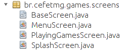
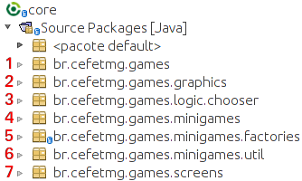
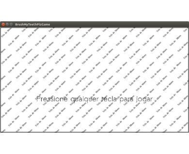
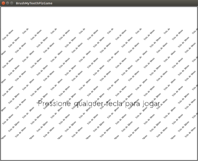
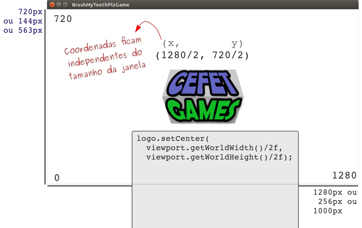

# cefet-games-meow-au

Um jogo simples, descomprometido e maroto descobrir sobre a secreta vida
animal.

## Instruções para Começar

O projeto deve ser entregue como um _Pull Request_ (veja
[[1]][using-pull-requests] e [[2]][creating-pull-requests]) neste repositório.
Ou seja, você deve fazer um _fork_ e, no **_branch_ `master`**, você deve
criar os dois microjogos.

Siga os passos:

1. (Um (01) integrante da dupla) faça um _fork_ deste repositório pela
   interface do Github.com.
1. Dê permissão de alteração no _fork_ para o colega.
1. Clonem o (seu) repositório _forked_ para seu computador.
1. Criem um _branch_ cujo nome é o primeiro nome do(s) integrante(s) do grupo,
   sem letras maiúsculas e com hífen separando o(s) nome(s).
   - Por exemplo, `git branch -b sandy-junior`.
1. Trabalhem fazendo _commits_ nesse _branch_.
1. Quando estiver pronto, faça um _Pull Request_ do seu branch (_e.g._,
   `leandro-leonardo`) para o _branch_ `master` do professor.


### Descrição da Implementação

Veja alguns detalhes sobre a implementação do jogo a seguir.

#### Telas

O jogo possui algumas telas, como de _splash_ (inicial), menu principal e
"de jogo", e o código referente a cada uma reside em uma classe que herda de
`BaseScreen`.




#### Pacotes

As classes do projeto estão modularizadas nos seguintes pacotes:



1. `br.cefetmg.games`: classes de inicialização e configuração geral do jogo.
1. `br.cefetmg.games.graphics`: classes com utilitários gráficos.
1. `br.cefetmg.games.logic.chooser`: classes de utilidade para a lógica de jogo.
1. `br.cefetmg.games.minigames`: classes referentes aos _microgames_.
1. `br.cefetmg.games.minigames.factories`: classes referentes às fábricas
   abstratas que são responsáveis por instanciar os _microgames_.
1. `br.cefetmg.games.minigames.util`: classes utilitárias aos _microgames_.
1. `br.cefetmg.games.screens`: classes referentes às telas do jogo.

#### _Assets_

Os _assets_ (recursos gráficos e de áudio) do jogo ficam na pasta `core/assets`:


Os _assets_ de cada _microgame_ devem estar dentro de uma pasta cujo nome é
o nome dele, **sem maiúsculas e acentuação, com hífen separando as palavras,**
caso haja mais de uma (_e.g._, `assets/shoot-the-caries`).

Para os _microgames_, estamos usando um **gerenciador de _assets_** para
pré-carregá-los de forma que, quando da execução da sequência de _microgames_,
o jogo não pára para carregar os recursos e isso dá uma experiência de jogo
melhor.

Para usar o gerenciador, supondo que você está criando um `SuperMicroJogo`,
cada _microgame_ deve ser implementado em 2 passos:

1. Declarar de quais _assets_ ele precisa, na classe `SuperMicroJogoFactory`.
   Por exemplo:
   ```java
   public class SuperMicroJogoFactory implements MiniGameFactory {
       // ...

       @Override
       public Map<String, Class> getAssetsToPreload() {
           return new HashMap<String, Class>() {
               {
                   put("super-micro-jogo/personagem.png", Texture.class);
                   put("super-micro-jogo/tiro.wav", Sound.class);                  
               }
           };
       }
   }  
   ```
1. Solicitar os _assets_ já carregados ao gerenciador, na classe do
   _microgame_ propriamente dito. Por exemplo:
   ```java
   public class SuperMicroJogo extends MiniGame {
       private Texture texturaPersonagem;
       private Sound somTiro;

       public SuperMicroJogo(BaseScreen screen,
             GameStateObserver observer, float difficulty) {
           super(screen, difficulty, 10000,
                   TimeoutBehavior.FAILS_WHEN_MINIGAME_ENDS, observer);
       }

       @Override
       protected void onStart() {
           this.texturaPersonagem = screen.assets.get(
                  "super-micro-jogo/personagem.png", Texture.class);
           this.somTiro = screen.assets.get(
                  "super-micro-jogo/tiro.wav", Sound.class);
           // ...
       }
       // ...
   }
   ```

Após criar classes que herdam de `MiniGame` e `MiniGameFactory`, você
deve ir até `PlayingGamesScreen` e alterar o construtor de `GameSequencer`
para receber as _factories_ dos seus _microgames_.

_Nota: para ver como o pré-carregamento está sendo feito, procure na classe
`GameSequencer`._

#### Sistema de Coordenadas

Como muito bem lembramos da queridíssima aula de Computação Gráfica, uma
aplicação em OpenGL possui pelo menos 2 sistemas de coordenadas extremamente
importantes:

- O **sistema de coordenadas do mundo** (arbitrário, definido por nós)
- O **sistema de coordenadas da janela** (definido em pixels)

Em jogos digitais, qual deve ser o comportamento quando um usuário redimensiona
a janela? Há pelo menos 3 possibilidades:

1. A imagem que estamos renderizando fica espichada ou achatada (não
   queremos isso)
1. Mantemos a razão de aspecto (a imagem não distorce) e fazemos com que toda
   a imagem renderizada caiba dentro do espaço disponível
   - Isso faz com que surjam barras laterais ou superioes-inferiores "em branco"
     quando a nova dimensão da janela tem uma razão de aspecto diferente
     daquela para a qual o jogo foi programado (veja a imagem a seguir)
1. Mantemos a razão de aspecto e aumentamos o espaço do mundo que é visível ao
   jogador





É possível e bem simples fazer qualquer uma dessas formas na LibGDX. Optamos
pela forma (2) porque ela permite que usemos valores virtuais para largura e
altura da tela... como assim?

Podemos ver 3 constantes importantes em `Config.java`:
```java
public class Config {

    /**
     * A largura do mundo de jogo.
     *
     * Todos os objetos (sprites, etc.) devem estar contidos em coordenadas x
     * que vão de 0 a WORLD_WIDTH para que apareçam na tela.
     */
    public static final int WORLD_WIDTH = 1280;

    /**
     * A altura do mundo de jogo.
     *
     * Todos os objetos (sprites, etc.) devem estar contidos em coordenadas y
     * que vão de 0 a WORLD_HEIGHT para que apareçam na tela.
     */
    public static final int WORLD_HEIGHT = 720;

    public static final float DESIRED_ASPECT_RATIO
            = (float) WORLD_WIDTH / (float) WORLD_HEIGHT;

    // ...
}
```

Repare na figura a seguir. Podendo considerar que o sistema de coordenadas
do mundo é sempre x E [0,1280] e y E [0,720], fica fácil posicionar os
elementos de forma que eles estarão aonde queremos independente da
resolução atual da janela do jogo.



## FAQ

1. **Pergunta**: Por que o código está em inglês?
   - **Resposta**: ~~mania do professor~~ as linguagens de programação e
     seus compiladores costumam ter problemas para identificar caracteres com
     acentuação nos códigos-fonte. Poderíamos escrever em Português sem usar a
     acentuação, porém se escrevermos em inglês, além de descartar essa
     possibilidade de problemas, tornamos o código-fonte acessível a leitores
     estrangeiros que saibam ler em Inglês.
1. **Pergunta**: Fiz meu _fork_, mas o professor foi lá e fez mais _commits_...
   agora meu  _fork_ está desatualizado. Como faço para ressincronizá-lo do
   o do professor?
   - **Resposta**: basta [atualizar o _branch_ master a partir do _fork_][syncing-fork]

[enunciado]: https://github.com/fegemo/cefet-games/blob/master/assignments/tp1-brushmyteethplz/README.md
[using-pull-requests]: https://help.github.com/articles/using-pull-requests/
[creating-pull-requests]: https://help.github.com/articles/creating-a-pull-request/
[syncing-fork]: https://help.github.com/articles/syncing-a-fork/
